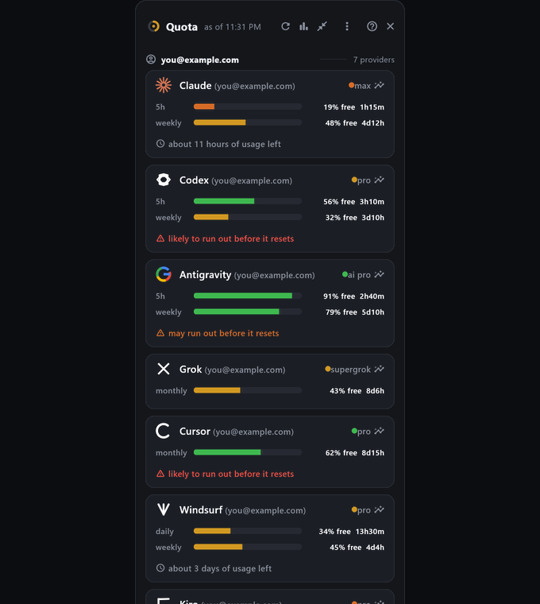

# quotabot

[](https://github.com/blisspixel/quotabot/actions/workflows/ci.yml)
[](LICENSE)

**htop for your agentic-AI quota plans.**

See how much quota you have left across your agentic AI coding subscriptions, in
one place, and route the next request to whichever one has budget, so you never
stall mid-flow on a spent cap or leave paid quota sitting unspent.

> Early and under active development (0.x). The core works and is in daily use;
> expect changes on the road to 1.0. See [ROADMAP.md](ROADMAP.md).

quotabot does two things:

1. **Shows your remaining quota** for the rolling-window subscriptions you pay
   for: Claude (Pro/Max), Codex (OpenAI), Antigravity / Gemini (Google), and
   Grok (xAI). It also surfaces what your **local LLM runtimes** (Ollama, LM
   Studio, Lemonade) have loaded, so a free local model is always in view.
2. **Recommends where to send the next request.** `quotabot suggest` (and the
   same logic over MCP) ranks your subscriptions by confidence-weighted runway
   and falls back to a local model when they are low, so AI tools and agents can
   route across your accounts instead of stalling on a spent cap.

It reads the usage your tools already track locally, so most providers need no
setup (Claude and Codex just work; a one-time login covers Antigravity and Grok).

<p align="center">
  
</p>

<p align="center"><sub>Demo mode: the desktop widget, compact strip, 90-day analytics view, and <code>quotabot top</code>.</sub></p>

Highlights:

- **Cross-platform.** One codebase on Windows, macOS, and Linux.
- **Easy and good-looking.** A small frameless widget that follows the system
  light/dark theme, supports per-profile themes including a high-contrast Hacker
  mode, pins always-on-top or to the taskbar, and collapses to a tiny status
  strip.
- **Useful analytics, no surveillance.** Insight into your own usage patterns
  (distribution, reliability, trend, smoothed and reset-aware best times to
  run). Only quota metadata is ever read, never prompts, code, or other content.
- **Zero usage tokens.** Only quota metadata is ever read, never a model or
  inference call, so quotabot never spends a usage token.
- **Local-first, your data is yours.** No account, no cloud, no telemetry; your
  tokens, history, and preferences stay on your machine. Most reads are local
  files; for a few providers quotabot makes a minimal call to the provider's own
  quota endpoint (reusing a token their app already stored) only when needed, and
  sends none of your prompts, code, or content.

## What it shows

Each provider is a card with one bar per rolling window (for example a 5 hour and
a weekly window): green when healthy, amber as it tightens, red when spent, with a
reset countdown. A longer window overrides a shorter one, so a spent weekly cap
collapses the card to a single "weekly spent - resets in 2d" line rather than
showing a green 5 hour bar you cannot use. Local runtimes have no quota, so their
card reports installed and loaded models instead, and acts as a routing fallback.

The same view is available live in the terminal with `quotabot top`, a small
dashboard that redraws in place and, when it has enough history, notes which
window is likely to run out first. Full walkthrough of the widget, analytics, and
CLI: [docs/USAGE.md](docs/USAGE.md).

## Provider status

| Provider     | Source                                                   | Live usage      |
|--------------|----------------------------------------------------------|-----------------|
| Claude       | OAuth usage endpoint, token reused from Claude Code       | Yes             |
| Codex        | `rate_limits` event in the newest session rollout        | Yes             |
| Antigravity  | Google Cloud Code API (Gemini), token reused and refreshed | Yes, signed-in account |
| Grok         | gRPC-web billing endpoint, token reused from the CLI     | Yes, when fresh |
| Cursor       | Local credits/state; passive detect for free/Pro          | opportunistic   |
| Windsurf     | Local `cachedPlanInfo` (daily/weekly Cascade quota)       | opportunistic   |
| Kiro         | Local credits/state (CLI+IDE); passive detect             | opportunistic   |
| Ollama / LM Studio / Lemonade | Local server; installed and loaded models | when running |
| Manual entries | User-entered limit, used count, and reset for any tool  | self-reported   |

Claude and Codex are always live with no setup. Antigravity and Grok are live for
the account their app is signed into; quotabot refreshes that token on its own.
Google's consumer Gemini CLI has been superseded by Antigravity, so Google
coverage runs through the Antigravity adapter. Any OpenAI-compatible local server
(Lemonade, Jan, llama.cpp, GPT4All, and similar) is detected the same way.

For exactly where each number comes from, see
[docs/DATA_SOURCES.md](docs/DATA_SOURCES.md); for each provider's own usage
command, [docs/PROVIDER_CLIS.md](docs/PROVIDER_CLIS.md).

For a tool quotabot does not read yet, `quotabot manual set` adds a local
self-reported quota window. Manual entries appear in the same views and JSON
snapshots with `source: "manual"`, but they are not treated as measured provider
telemetry.

## Install

**macOS / Linux**
```bash
curl -fsSL https://raw.githubusercontent.com/blisspixel/quotabot/main/install.sh | bash
```

**Windows (PowerShell)**
```powershell
irm https://raw.githubusercontent.com/blisspixel/quotabot/main/install.ps1 | iex
```

Restart your terminal, then run `quotabot doctor`. Claude and Codex should read
live immediately. Full getting-started guide, including which providers need a
one-time login: [docs/SETUP.md](docs/SETUP.md).

To build everything from source in one command (CLI, desktop app, and a
Desktop/tray shortcut), run `pwsh tools/setup.ps1` on Windows or
`bash tools/setup.sh` on macOS/Linux (add `-CliOnly` / `--cli-only` for just the
CLI). Details in [docs/BUILDING.md](docs/BUILDING.md).

## Keeping Antigravity and Grok live

Antigravity and Grok are live for the account their app is signed into, and
quotabot refreshes that token on its own. To pin a specific account, or if an app
is signed out, connect quotabot's own login once (no Google Cloud setup needed):

```bash
quotabot login grok          # device-code flow
quotabot login antigravity   # opens a browser; sign in with the account you want
quotabot doctor              # confirm it reads live
```

quotabot stores its own refresh token under your per-user config directory
(owner-only on POSIX), independent of the app's credentials. Details in
[docs/SETUP.md](docs/SETUP.md#4-keep-grok-and-antigravity-live-optional).

## Routing for tools and agents

```bash
quotabot suggest          # recommended provider + ranked alternatives
quotabot suggest --json   # the same decision for scripts and agents
quotabot suggest --local-first  # prefer local runtime before subscription quota
quotabot models           # every model you can route to now, with budget + caps
quotabot models --budget=local  # hard cap to free local-runtime models
quotabot watch            # alert when a window goes low, naming where to route
quotabot watch --waste-threshold=35  # alert when quota is projected to expire unused
quotabot top --exclude=codex  # hide a provider from this quota read only
quotabot suggest --use-expiring-quota  # model pick may use included quota before reset
quotabot report           # weekly quota-health markdown export
```

`quotabot watch` polls in the background and raises a low-quota alert the moment
a window is spent or nearly so, naming where to send work next. Add
`--waste-threshold=N` to also raise a `projected_waste` alert when the current
burn pace would leave at least N percent of a renewing paid window unused at
reset. Add `--webhook` to POST each alert (loopback unless `--allow-external`)
so it can reach a tray toast, a shell, or chat. Quota-reading CLI commands accept
`--exclude=A,B` after `--profile` for one-off provider avoidance without changing
saved profiles. The same recommendation is available over MCP stdio or
opt-in MCP Streamable HTTP (`suggest_provider`, cache-only `decide_now`,
`reserve_provider`/`release_provider` leases, `list_models`, `suggest_model`,
with optional `profile`/`account` filters, one-request `exclude` lists, and
`local_first` routing, model `budget` filters (`local` or measured `quota`), and
model `use_expiring_quota`, local model readiness (`loaded` versus `cold`), and
`quotas://alerts` subscriptions) and a
plain loopback HTTP JSON server (`GET /suggest?exclude=codex,grok` or
`GET /suggest?local_first=true`). For how an agent should call quotabot and route, see
[AGENTS.md](AGENTS.md). For a turnkey fleet setup, see the LiteLLM proxy plugin
in [integrations/litellm/](integrations/litellm/), which routes each request to
a deployment with budget, writes optional local routed-request metrics, and
defaults to no-surprise-billing guardrails: normal API-key deployments are
treated as paid API spend and skipped unless explicitly enabled, while true
included quota-plan deployments must be labeled separately and explicitly marked
with overages disabled. The analytics view surfaces those metrics, including
local/quota/paid API spend-class counts, when the plugin writes the default
`~/.quotabot/litellm-metrics.jsonl` file. For
language-client adoption, see the Python and TypeScript MCP snippets in
[integrations/mcp_clients/](integrations/mcp_clients/).

## Project layout

```
quotabot/
  app/           Flutter desktop application (Windows, macOS, Linux)
  collector/     Dart package: adapters, normalized model, auth, CLI, MCP server
  integrations/  LiteLLM proxy plugin and MCP client snippets
  docs/          Setup, usage, building, architecture, routing math, data sources
  tools/         Packaging, icon, and developer helper scripts
```

The app and the collector are both Dart; the app imports the collector directly.
For design and internals see [docs/ARCHITECTURE.md](docs/ARCHITECTURE.md).

## Disclaimer and terms of service

quotabot is an independent, unofficial tool. It is **not affiliated with,
endorsed by, or sponsored by** OpenAI, Anthropic, xAI, Google, Amazon, Cursor,
Codeium/Windsurf, or any other provider. All product names, logos, and trademarks
are the property of their respective owners and are used here only to identify the
service whose quota is being displayed.

quotabot reads only quota and usage metadata. It prefers local state, and for some
providers it makes a minimal call to the provider's own quota/usage endpoint -
reusing a token that provider's CLI or app already stored on your machine - to read
live numbers. It makes no model or inference calls, sends none of your prompts,
code, or content, and keeps your data on your machine. Even so:

- **You are solely responsible for ensuring your use complies with the Terms of
  Service and acceptable-use policies of every provider you connect to it.**
  Reading local state, reusing stored tokens, or automating routing may be
  restricted by a given provider's terms; review them and stop using quotabot
  with any provider whose terms it would violate for your account.
- Quota numbers are best-effort and may be incomplete, delayed, or wrong. Do not
  rely on them for billing or compliance; verify against the official dashboard.
- quotabot stores any login tokens you create under your user config directory.
  Protect that directory as you would any other credential store.

Provided "AS IS", without warranty, under the [Apache License 2.0](LICENSE). By
using quotabot you accept these terms; if you do not agree, do not use it.
