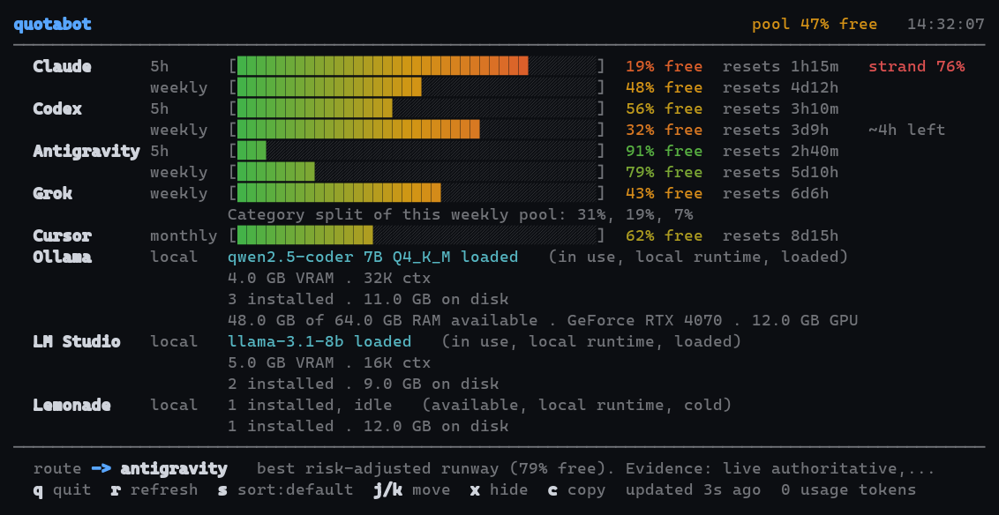
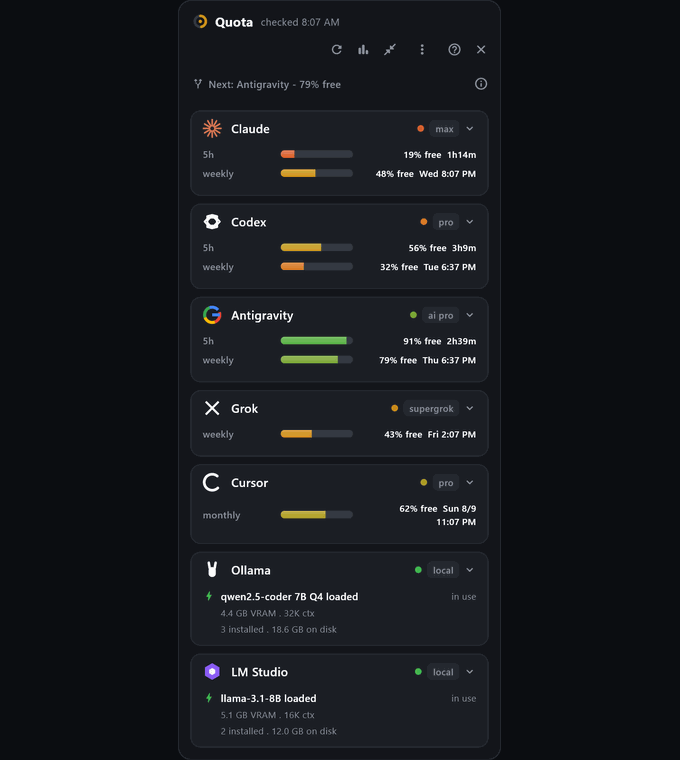

# quotabot

[](https://github.com/blisspixel/quotabot/actions/workflows/ci.yml)
[](LICENSE)

**htop for your agentic-AI quota plans.**

quotabot shows how much included quota remains across AI coding subscriptions
and recommends where to send the next request. It also reports supported local
runtimes, so work can fall back locally when subscription caps are low.

> **Current stable:** 0.9.9. quotabot remains under active 0.x development.
> **Current release candidate:** 0.10.0-rc.8.
> **Next:** a focused 0.10.x stabilization train, then signed release
> readiness. No new product breadth. See [roadmap Next](ROADMAP.md#next)
> and the [documentation index](docs/README.md).

Release candidates state Windows and macOS signing mode at the top of the
GitHub release notes. Owner provisioning lives in
[docs/RELEASE-SIGNING.md](docs/RELEASE-SIGNING.md).

quotabot is a local advisor, not a proxy. Quota and routing reads make no model
calls, spend no usage tokens, and never read prompts or source code. The CLI
is the complete workflow; the desktop app is optional.

## What it looks like

<p align="center">
  <a href="docs/screenshot-top.png"></a>
</p>

<p align="center"><sub>The standalone <code>quotabot top</code> CLI, captured from the real terminal dashboard renderer with built-in synthetic demo data.</sub></p>

<p align="center">
  <a href="docs/quotabot-demo.gif"></a>
</p>

<p align="center"><sub>Five generated demo views at 3 seconds per frame. <a href="docs/screenshot-widget.png">Desktop still</a> | <a href="docs/screenshot-analytics.png">Analytics still</a></sub></p>

## Quick start

Install the latest checksum-verified CLI release.

**macOS / Linux**

```bash
curl -fsSL https://raw.githubusercontent.com/blisspixel/quotabot/main/install.sh | bash
```

**Windows PowerShell**

```powershell
irm https://raw.githubusercontent.com/blisspixel/quotabot/main/install.ps1 | iex
```

Restart the terminal, then run:

```bash
quotabot doctor
quotabot suggest
```

`doctor` explains stale or unavailable evidence and gives a repair command.
`suggest` ranks usable subscriptions and supplies a local fallback when one is
available. For inspect-before-run installation, login, updates, rollback, and
uninstall, use the [setup guide](docs/SETUP.md).

## Core commands

| Goal | Command |
|---|---|
| Show the full quota snapshot | `quotabot` or `quotabot --json` |
| Check one provider | `quotabot check claude` |
| Pick the next provider | `quotabot suggest` |
| Prefer a local runtime | `quotabot suggest --local-first` |
| Preserve an included-quota reserve | `quotabot suggest --quota-stretch` |
| Pick a model for a task | `quotabot suggest --task=hard` |
| Inspect model availability and budget | `quotabot models` |
| Watch quota and routing changes | `quotabot top` or `quotabot watch` |
| Require selected reads to be live | `quotabot verify --require-live` |

Provider routing is balanced by default. `--local-first` prefers reachable
on-device capacity immediately. `--quota-stretch` keeps fresh measured included
quota above a reserve before preferring local capacity. Model suggestions use
included quota and local runtimes by default; paid or credit-backed catalog
entries require an explicit `--budget=any` opt-in.

See the [usage guide](docs/USAGE.md) for profiles, accounts, model capability
filters, alerts, analytics, drift recovery, routing receipts, and every command.

## Supported sources

Subscription sources include Claude, Codex, Antigravity / Gemini, Grok, Cursor,
Windsurf, Kiro, and optional NVIDIA NIM discovery. Cursor 3.x support passively
detects an owner-bound local plan, but Cursor does not persist its current quota
pools in the supported local state, so quotabot cannot yet route on Cursor
headroom. Local sources are Ollama, LM Studio, and Lemonade. Manual entries
remain explicitly self-reported. Exact endpoints, evidence classes, credential
behavior, and limitations are in [Data sources](docs/DATA_SOURCES.md);
provider-owned cross-checks are in [Provider CLIs](docs/PROVIDER_CLIS.md).

## Desktop app

Portable desktop bundles are published for Windows, macOS, and Linux alongside
the CLI. The app is optional. Windows signing and macOS Developer ID signing,
notarization, and stapling are required 0.10.x release-readiness gates.
The grouped Settings dialog includes the installed build and an explicit
**Check for updates** action. It contacts GitHub only after that action, shows
the latest candidate and latest stable release separately, and opens the chosen
release so signing status, checksums, assets, and update instructions stay
visible. Stable builds recommend stable updates without hiding newer previews;
release candidates follow the preview channel. The app never checks
automatically or prompts on launch.
Verification, launch, update, rollback, and uninstall belong in [Desktop
release bundles](docs/DESKTOP-DISTRIBUTION.md). Source setup and packaging are
in [Building from source](docs/BUILDING.md).

## Agents and integrations

The MCP server supports stdio and authenticated loopback HTTP. Its complete
tool and schema contract is in [AGENTS.md](AGENTS.md). See the
[LiteLLM integration](integrations/litellm/) and
[minimal MCP clients](integrations/mcp_clients/) for working examples.

## Privacy and trust boundary

- No quotabot account, hosted service, advertising, or telemetry.
- No model calls or reads of prompts, code, model output, or other user content.
- Local metadata stays local. Live adapters contact only provider quota or
  model-list metadata endpoints; Antigravity may perform required onboarding.
- The desktop update check reads public GitHub release metadata only after the
  user invokes it. It sends no quota, account, history, prompt, or code data.
- Routing fails soft, so callers can continue if quotabot is unavailable.

Run `quotabot explain` to inspect files and network destinations used by each
adapter. The complete promises and verification methods are in
[Principles](docs/PRINCIPLES.md), [Security](SECURITY.md), and
[Architecture](docs/ARCHITECTURE.md).

## Release and project status

The immutable [v0.9.9 release](https://github.com/blisspixel/quotabot/releases/tag/v0.9.9)
passed its 14-asset audit and cross-platform install and upgrade matrix. Its
Windows and macOS artifacts remain unsigned, so 0.10.x must repeat that evidence
with platform-signed artifacts before 1.0. See the [release
evidence](docs/BUILDING.md#baseline-release-evidence),
[roadmap](ROADMAP.md), [documentation index](docs/README.md),
[contributing guide](CONTRIBUTING.md), and [security policy](SECURITY.md).

## Disclaimer

quotabot is independent and unofficial. Quota metadata is best-effort; verify
billing and compliance against each provider. Provided "AS IS", without
warranty, under the [Apache License 2.0](LICENSE).
